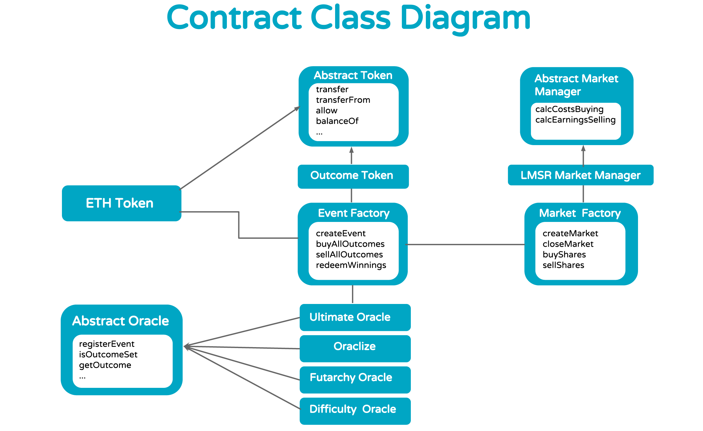

Gnosis Smart Contracts
===================


[](http://slack.gnosis.pm)

Collection of smart contracts for the Gnosis prediction market platform (https://www.gnosis.pm).

Architecture
-------------


Contracts
-------------
All contracts have been tested with Solidity version 0.4.4.
### DAO
#### [DAO.sol](contracts/solidity/DAO/DAO.sol)
A placeholder contract for a future DAO governance contract. Offers interfaces to calculate fees for trades based on sender and token count. Can be upgraded by a wallet contract controlled by Gnosis founders.

#### [DAODutchAuction.sol](contracts/solidity/DAO/DAODutchAuction.sol)
Implements the Dutch auction used by Gnosis for the token launch. Accepts bids using bid function until funding goal or stop price is reached. After the auction is completed, every successful bidder can claim his tokens using the claimTokens function.

#### [DAOToken.sol](contracts/solidity/DAO/DAOToken.sol)
Gnosis token (GNO) contract. At deployment all tokens are assigned to the auction contract. Auction contract transfers tokens to bidders according to their bid and final token price. 
Tokens can be traded after the auction is over and one week passed.

### Event Factory
#### [EventFactory.sol](contracts/solidity/EventFactory/EventFactory.sol)
Allows creation of new events used to resolve markets. Events can resolve to a number in a range (ranged event) or an outcome out of a list of outcomes. An example for a ranged event is the Apple stock price on date X. An example for a non-ranged event would be the winner of the World Cup on date X. For every outcome, an outcome token is created. Ranged events are represented with two outcome tokens for long and short positions. Non-ranged events have an outcome token for every defined outcome. Every event defines an oracle contract to resolve the event and a token contract denominating the currency used in markets using this event. The event factory contract allows to buy and sell all outcomes for 1 unit of the currency of the event. Winnings can be redeemed after the event has been resolved using the defined oracle.

#### [OutcomeToken.sol](contracts/solidity/EventFactory/OutcomeToken.sol)
Outcome tokens are created for every outcome of an event. Only the event factory contract is allowed to issue and revoke outcome tokens using buy and sell all outcome functions.

#### [OutcomeTokenLibrary.sol](contracts/solidity/EventFactory/OutcomeTokenLibrary.sol)
Implements basic token functionality like transfer and transferFrom. The library is used to reduce the deployment gas costs of outcome tokens.

### Market Crowdfunding
#### [MarketCrowdfunding.sol](contracts/solidity/MarketCrowdfunding/MarketCrowdfunding.sol)
Allows crowdfunding of automated market makers and distributes collected fees among investors.

### Market Factories
#### [DefaultMarketFactory.sol](contracts/solidity/MarketFactories/DefaultMarketFactory.sol)
Allows to create markets and trade outcome tokens on markets with a market maker. A market is always associated to an event and has to be funded in the event’s denomination. A market maker contract like the LMSR market maker has to be defined to allow trading. A fee charged for every trade on a market can be defined to return the investment used to fund the market maker.

#### [HunchGameMarketFactory.sol](contracts/solidity/MarketFactories/HunchGameMarketFactory.sol)
Inherits functionality from DefaultMarketFactory and adds functionality required for the HunchGame Gnosis App (high-score etc.).

### Market Makers
#### [LMSRMarketMaker.sol](contracts/solidity/MarketMakers/LMSRMarketMaker.sol)
Calculates prices for event outcome tokens based on demand using a logarithmic market scoring rule. Implementing Robin Hanson’s designed LMSR market maker.

### Oracles
All oracle contracts implement the oracle interface for time-limited events developed by Gnosis in cooperation with other oracle providers like Reality Keys. Specifications will be released soon.

#### [DefaultFallbackOracle.sol](contracts/solidity/Oracles/DefaultFallbackOracle.sol)
Implements a simple fallback oracle solution allowing to overwrite oracle results with another account controlled by a separate private key.

#### [DifficultyOracle.sol](contracts/solidity/Oracles/DifficultyOracle.sol)
Allows to resolve markets based on the difficulty at block X.

#### [FutarchyOracle.sol](contracts/solidity/Oracles/FutarchyOracle.sol)
Allows to resolve a market based on the outcome of a dependent market to use markets for decision making. An introduction to the futarchy concept can be found here: https://blog.ethereum.org/2014/08/21/introduction-futarchy/

#### [OraclizeOracle.sol](contracts/solidity/Oracles/OraclizeOracle.sol)
An oracle contract wrapping around the oracle service provided by Oraclize. Allows to resolve any ranged event supported by Oraclize.

#### [UltimateOracle.sol](contracts/solidity/Oracles/UltimateOracle.sol)
Allows to use signed results by off-chain oracle providers like Reality Keys. Multiple oracles can be combined to resolve an event. A majority vote will define the final outcome. An oracle result can be challenged by anyone within a challenge period. If an oracle was challenged its result will be overwritten by the Ultimate Oracle. When an oracle result was challenged, a second market is opened to define the right outcome. Everyone can put Ether on the outcome they believe is the right outcome. If the frontrunner is not changed within a decision period, the frontrunner will be set as the final ultimate outcome. To make sure a single Ether holder cannot bet all his money at once, the amount allowed to bid on the frontrunner is in relation to all Ether bet on all other outcomes. The Ultimate Oracle contracts supports the use of fallback oracles.

### State Channels
#### [StateChannel.sol](contracts/solidity/StateChannels/StateChannel.sol)
Generic settlement contract for off-chain transactions. Can be used to settle Gnosis trade agreements between multiple parties.

### Tokens
#### [EtherToken.sol](contracts/solidity/Tokens/EtherToken.sol)
An ERC20 compliant token exchanging Ether and Ether-tokens 1:1. All Gnosis contracts allow using tokens implementing the ERC20 token interface and don’t allow direct usage of Ether.

#### [HunchGameToken.sol](contracts/solidity/Tokens/HunchGameToken.sol)
Token used by the HunchGame Gnosis App. Allows HunchGameMarketFactory to issue new HunchGame tokens. The account used to deploy the contract receives almost unlimited amount of tokens for market making.

#### [StandardToken.sol](contracts/solidity/Tokens/StandardToken.sol)
An implementation of the ERC standard token. Discussion: https://github.com/ethereum/EIPs/issues/20

### Utils
#### [Lockable.sol](contracts/solidity/Utils/Lockable.sol)
Allows an inheriting contract to use global locks for function calls.

#### [MathLibrary.sol](contracts/solidity/Utils/MathLibrary.sol)
Provides basic math functionality for calculating natural exponential function and natural logarithmic function. This is a Solidity version of Chris Calderon's implementation in Serpent, which is part of the Augur project: https://github.com/AugurProject/augur-core/blob/develop/src/data_api/fxpFunctions.se

### Wallets
#### [MultiSigWallet.sol](contracts/solidity/Wallets/MultiSigWallet.sol)
Allows multiple parties to agree on transactions before execution. Allows to add and remove owners and update the number of required confirmations.

Install
-------------
```
git clone https://github.com/ConsenSys/gnosis-contracts.git
cd gnosis-contracts
vagrant up
```

Test
-------------
### Run all tests:
```
cd /vagrant/
python -m unittest discover contracts
```

### Run one test:
```
cd /vagrant/
python -m unittest contracts.tests.test_name
```

Deploy
-------------
### Deploy all contracts:
```
cd /vagrant/contracts/
python deploy.py -f deploy/all.json
```

### Deploy all contracts required for the token launch:
```
cd /vagrant/contracts/
python deploy.py -f deploy/tokenlaunch.json
```

Security
-------------
**No security audit has been completed yet.** Contracts related to the token launch are currently being audited. All contracts are WITHOUT ANY WARRANTY; without even the implied warranty of MERCHANTABILITY or FITNESS FOR A PARTICULAR PURPOSE.

Bug Bounty
-------------
A bug bounty will be announced very soon. In the meantime have a look at the contracts, which will be included in the bounty program:

- [AbstractDAOAuction.sol](contracts/solidity/DAO/AbstractDAOAuction.sol)
- [DAODutchAuction.sol](contracts/solidity/DAO/DAODutchAuction.sol)
- [DAOToken.sol](contracts/solidity/DAO/DAOToken.sol)
- [AbstractToken.sol](contracts/solidity/Tokens/AbstractToken.sol)
- [StandardToken.sol](contracts/solidity/Tokens/StandardToken.sol)
- [MultiSigWallet.sol](contracts/solidity/Wallets/MultiSigWallet.sol)

License
-------------
No license has been defined yet. We will add a license as soon as possible. Until then copyright is hold by ConsenSys only.

Excluded from those constraints are the following contracts:

- [MistWallet.sol](contracts/solidity/Wallets/MistWallet.sol): Developed by Gavin Wood
- [MathLibrary.sol](contracts/solidity/Utils/MathLibrary.sol): Based on Augur’s implementation. Released under GPL3

Contributors
-------------
A bug bounty will be announced very soon. In the meantime have a look at the contracts, which will be included in the bounty program:

- Stefan George ([Georgi87](https://github.com/Georgi87))
- Martin Köppelmann ([koeppelmann](https://github.com/koeppelmann))
